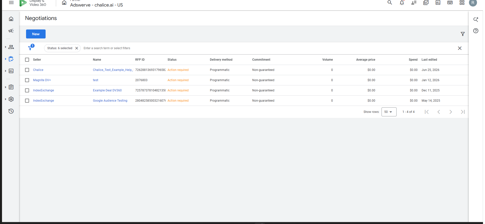
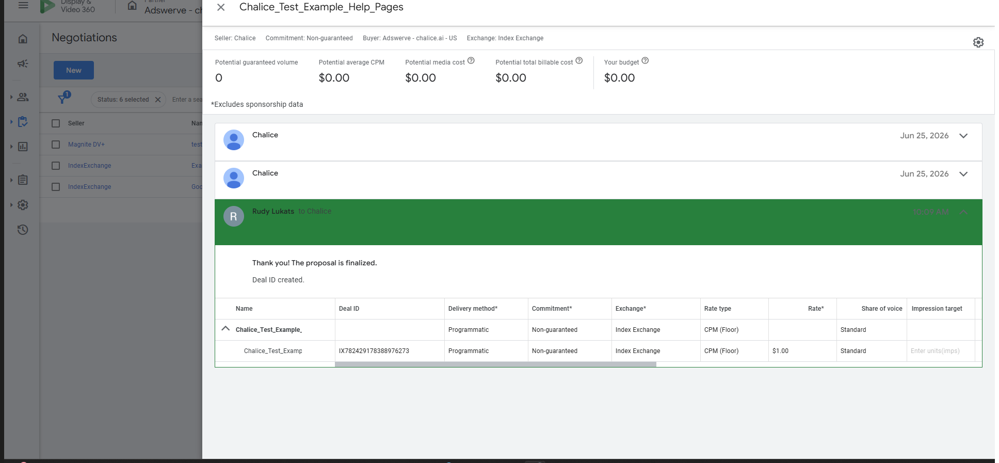
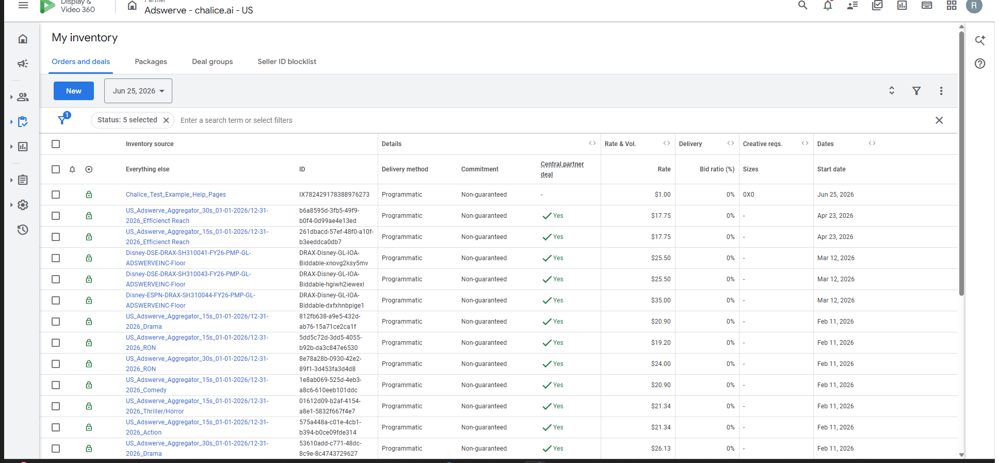

# Deal Desk: Accepting a PMP Deal in DV360

After your Chalice account manager pushes a PMP deal to your DV360 seat, you'll receive it in the **Negotiations** section of Inventory. The deal will show an **Action required** status until you accept it. This page walks through the full acceptance flow.

---

## Step 1. Go to Inventory > Negotiations

In the left side panel, expand **Inventory** and select **Negotiations**.

You'll see a list of all pending deals. Look for the deal name your Chalice account manager provided — it will appear with a status of **Action required** and the seller listed as **Chalice**.

!!! tip
    The **Status** column is filterable. If you don't see the deal, make sure the filter includes **Action required**.

---

## Step 2. Open the deal

Click the deal name in the **Name** column to open the deal panel on the right side of the screen.

The panel shows the seller, commitment type, buyer account, and exchange. Below that is a proposal from Chalice requesting your acceptance, with a table listing the deal name, Deal ID, delivery method, floor rate, and exchange.

You'll see an **Accept** button and an **Archive** link below the proposal message.

---

## Step 3. Accept and confirm

Click **Accept**. A confirmation dialog will appear:

> **Agree to terms?**
> By accepting this proposal, I agree to the negotiated terms.

Click **Agree** to finalize.

---

## Step 4. Acceptance confirmed

Once accepted, the panel updates with a green confirmation banner:

The message reads **"Thank you! The proposal is finalized. Deal ID created."** The deal is removed from the **Action required** queue in Negotiations.

---

## Step 5. Verify the deal in My Inventory

Navigate to **Inventory > My Inventory** to confirm the deal is now live in your seat.

The deal will appear near the top of the list. Confirm the Deal ID matches what your account manager provided.

---

## Next step

The deal is now accepted and available to use. See [Line Item Best Practices for PMP Deals in DV360](line-item-best-practices-pmp.md) for how to attach it to a line item and configure targeting correctly.

---

## Related articles

- [Line Item Best Practices for PMP Deals in DV360](line-item-best-practices-pmp.md)
- [Opting into the Appropriate Exchange](opting-into-the-appropriate-exchange.md)