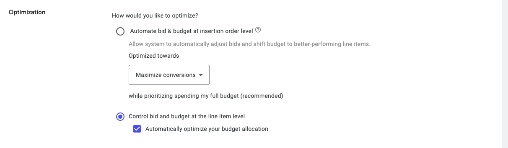
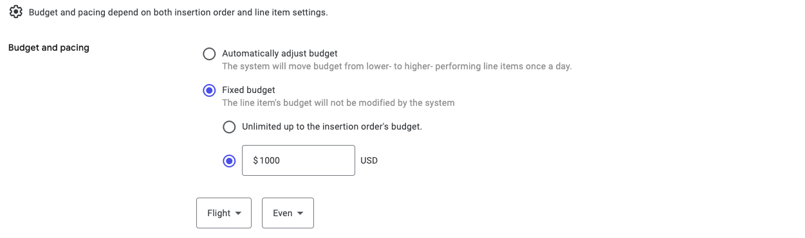
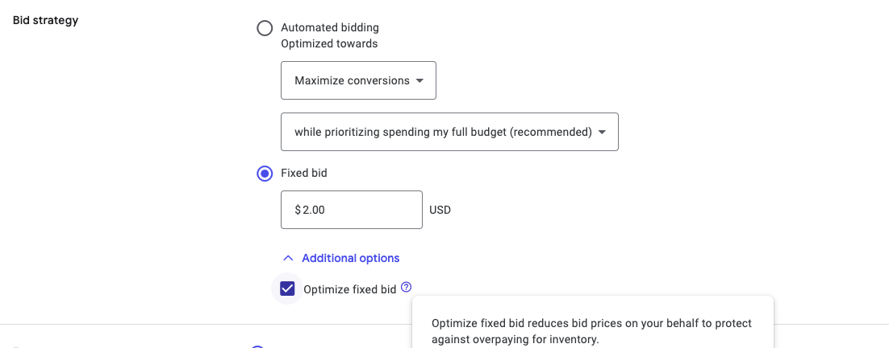
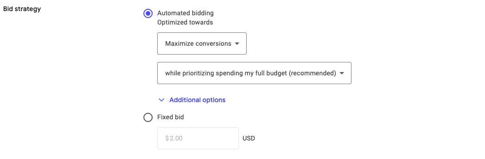
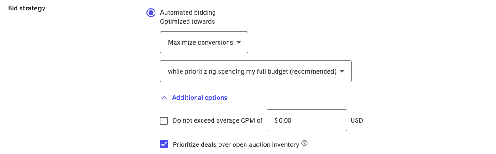
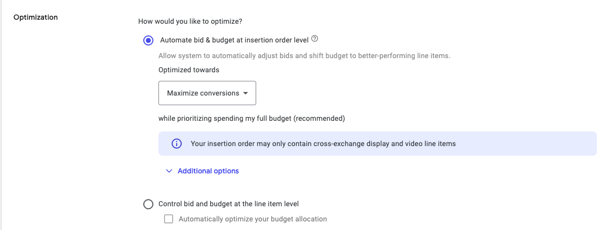
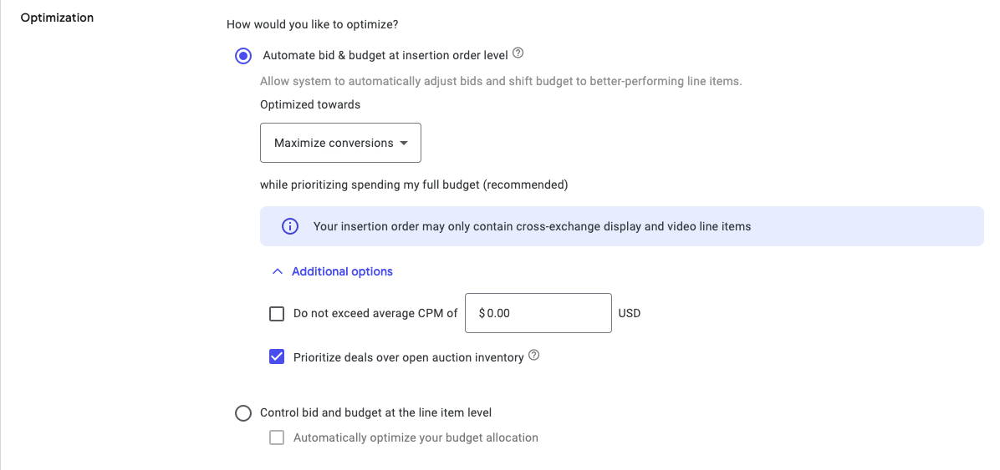

# DV360 Deal Setup Best Practices

Targeting a Chalice curated deal in DV360 works best when you keep control of bidding and budget at the line item. The wrong optimization settings can make DV360 bid below the deal floor price, which starves spend on your deal. This guide covers the two main insertion order optimization paths, what each one does to deal delivery, and the settings we recommend.

For the step-by-step on attaching the deal to a line item, see the [Line Item Setup Guide for PMP Deals in DV360](line-item-setup-guide-pmp.md).

!!! tip "Quick answer"
    For reliable delivery on a Chalice deal, control bid and budget at the line item, set a fixed budget, and use a fixed bid with "Optimize fixed bid" left on. Avoid insertion order level automation unless you have a specific reason to use it.

---

## Recommended: control bid and budget at the line item

This is the preferred setup. It gives you direct control over deal-level budget and bidding, so DV360 cannot shift spend away from your deal or bid below the floor.

### At the insertion order

Leave "Automatically optimize your budget allocation" unchecked. When it is on, DV360 moves budget from lower to higher performing line items once a day using the insertion order flight budget.

!!! warning
    If that box is checked, DV360 can pull budget off your deal line item whenever it judges other lines to be performing better. That reduces spend on the curated deal.

### Line item budget

Set a fixed budget on the deal line item. This lets you see exactly how much budget the deal is getting and keeps it from being reallocated.

### Line item bidding

Use a fixed bid. Under "Additional options," leave "Optimize fixed bid" enabled.

!!! tip
    With a fixed bid, "Optimize fixed bid" helps manage your CPMs without bidding below the deal floor. If you do not have a specific bid in mind, it optimizes CPMs for you. Your Chalice team can recommend a starting bid.

#### If you use automated bidding instead

!!! warning "Automated bidding is the number one cause of low deal delivery"
    With automated bidding, DV360 optimizes toward your line item KPI by bidding as efficiently as possible. That means it can bid below the deal floor price, which leads to little or no spend on the curated deal.

To protect deal delivery, open "Additional options" on the line item and enable "Prioritize deals over open auction inventory."

---

## Not recommended: automate bid and budget at the insertion order

!!! warning
    When DV360 controls both bidding and budget at the insertion order level, it can underbid your deal and move budget away from the deal line item at the same time. Both hurt deal delivery.

If a campaign has to run this way, open "Additional options" at the insertion order and enable "Prioritize deals over open auction inventory," then watch deal spend closely.

---

## What "Prioritize deals over open auction inventory" does

Straight from DV360: if an insertion order or line item only targets deals, this setting lets you bid up to the floor price for deal inventory. If you target deals and open auction together, it prioritizes deal inventory while still optimizing your open auction bids for performance.

---

## Best practices cheat sheet

| Scenario | IO level setting | Line item budget | Line item bidding | Notes |
| --- | --- | --- | --- | --- |
| Maximize spend on the deal | Control at line item | Fixed budget | Fixed bid (example: Display around $2, Video around $5) | Most control. Best for guaranteed delivery on the deal. |
| Maximize spend and performance | Control at line item | Fixed budget | Automated bidding (maximize conversions) with "Prioritize deals over open auction inventory" on | Balances performance with deal delivery. |
| Insertion order automation required | Automate at IO level | Managed by DV360 | Managed by DV360 | Turn on "Prioritize deals over open auction inventory" at the IO level. Watch deal spend closely, DV360 may still shift budget off the deal. |

Bid figures are examples. Your Chalice team will share tailored bid guidance for your markets and formats.

---

## Related articles

- [Line Item Setup Guide for PMP Deals in DV360](line-item-setup-guide-pmp.md)
- [Accepting a PMP Deal in DV360](accepting-a-pmp-deal.md)