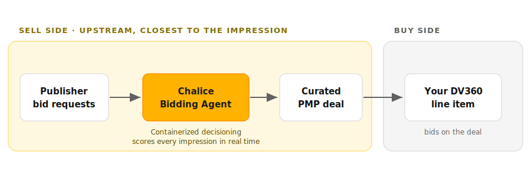

# Line Item Best Practices for PMP Deals in DV360

!!! note "What you're activating: Chalice sell-side decisioning"
    Chalice PMP deals run on sell-side decisioning. Instead of waiting for a DSP to filter requests and bid, Chalice applies your custom AI decisioning upstream, closer to the impression where the signal is cleanest.

    Chalice calls this containerization. Your decisioning is packaged into a container that runs on the sell side, scores each impression against your outcomes, and curates inventory in real time. Less latency, less data loss, better signal.

    That's why this guide points your line item at the Chalice deal only. The quality and relevance work already happened sell-side, so you keep budget on that curated deal instead of competing with open exchange.

    New to the concept? See Index Exchange on [how sell-side decisioning works](https://www.indexexchange.com/index-explains/how-does-sell-side-decisioning-work/) and Chalice's Freddie Turner on [AI, trust, and the future of programmatic](https://newdigitalage.co/ai/freddie-turner-ai-trust-and-the-future-of-programmatic/).

Follow these steps to set up a line item that targets a Chalice PMP deal exclusively. This keeps your budget directed to the deal inventory instead of competing on the open exchange.

!!! note
    DV360 uses Insertion Orders and Line Items rather than Ad Groups. Screenshots are being added, and labels may shift between releases.

---

## Step 1. Accept the deal first

Before building the line item, make sure the deal is accepted and active. See [Accepting a PMP Deal in DV360](accepting-a-pmp-deal.md).

---

## Step 2. Create an Insertion Order

In your campaign, create a new **Insertion Order**. Set the budget, pacing, and flight dates at the IO level.

---

## Step 3. Create a line item

Inside the Insertion Order, create a new **line item**. Give it a descriptive name that references the deal, for example `Chalice PMP - [Deal ID] - [Campaign]`.

---

## Step 4. Set the inventory source to the deal

1. Open the line item's **Inventory source** settings.
2. Choose to target **Deals and inventory packages** only, not open exchange.
3. Search for your deal by name or Deal ID.
4. Select the Chalice deal and add it.

!!! tip
    Targeting the deal only is what keeps spend on the curated inventory. If you leave open exchange enabled, the line item can spend outside the deal.

---

## Step 5. Set your bid and keep targeting broad

Set your budget, flight dates, and bid on the line item. Chalice suggests leveraging a fixed bid. Keep other targeting broad at launch. Layering on too many filters early can choke delivery before the model has data to optimize against.

Suggested CPM bids by country and channel

Your Chalice support team will provide tailored bid recommendations for your line item. Standard bid guidance by country is listed below. Use the selector to view it in another currency.

<label for="bid-currency" style="margin-right:6px;">Currency</label>
<select id="bid-currency">
<option value="USD">USD ($)</option>
<option value="EUR">EUR (&euro;)</option>
<option value="GBP">GBP (&pound;)</option>
<option value="DKK">DKK (kr)</option>
<option value="NOK">NOK (kr)</option>
</select>

<table id="bid-table">
<thead><tr><th>Country</th><th>Display CPM</th><th>Video CPM</th></tr></thead>
<tbody>
<tr><td>Denmark</td><td class="bid" data-usd="1">$1.00</td><td class="bid" data-usd="4">$4.00</td></tr>
<tr><td>France</td><td class="bid" data-usd="4">$4.00</td><td class="bid" data-usd="5">$5.00</td></tr>
<tr><td>Norway</td><td class="bid" data-usd="5">$5.00</td><td class="bid" data-usd="6">$6.00</td></tr>
<tr><td>Spain</td><td class="bid" data-usd="3">$3.00</td><td class="bid" data-usd="4">$4.00</td></tr>
<tr><td>UK</td><td class="bid" data-usd="3">$3.00</td><td class="bid" data-usd="7">$7.00</td></tr>
<tr><td>US</td><td class="bid" data-usd="4">$4.00</td><td class="bid" data-usd="7">$7.00</td></tr>
</tbody>
</table>

---

## Step 6. Save and set live

Save the line item, then set both the line item and the Insertion Order to live.

---

## Step 7. Verify the deal is attached

Open the line item and confirm the Chalice deal appears under **Inventory source**.

!!! warning
    If the deal does not appear, go back and confirm it was accepted and set to active in the deal library, and that you selected "Deals only" in Step 4.

---

## Related articles

- [Accepting a PMP Deal in DV360](accepting-a-pmp-deal.md)
