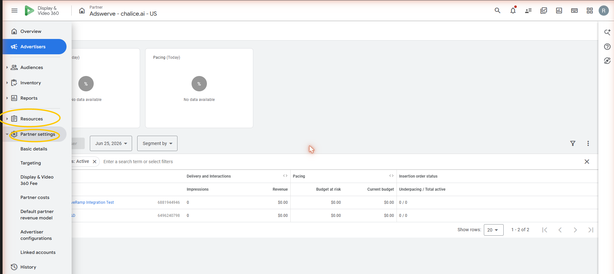
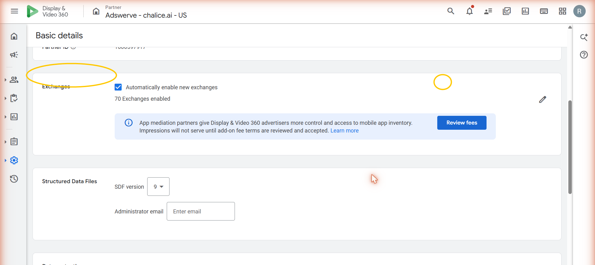
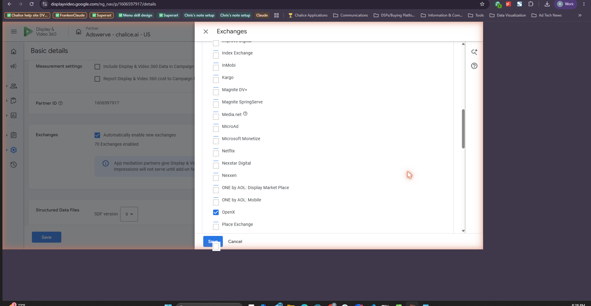
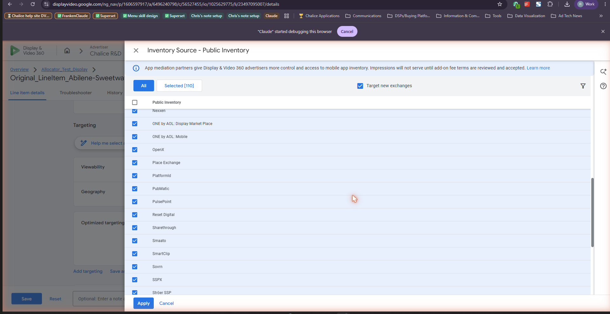

# DV360: Opting into the Appropriate Exchange

To enable the appropriate exchange for direct targeting within your DV360 seat, follow the steps below. You will need admin access to the partner to complete this process.

---

## Step 1. Open Partner settings

Go to **Partner**, then the **Settings** page.

---

## Step 2. Open Basic Details and find Exchanges

Click **Basic Details**, then scroll down to the **Exchanges** option.

---

## Step 3. Check the exchange moving to a direct integration

Open it and check the box next to the appropriate exchange. You will see a tooltip like the one below explaining how the automatic migration works, referencing Google's [Help Center article](https://support.google.com/displayvideo/answer/9230278).

---

## Step 4. Confirm it is selected on your line items

Go into your line items and make sure the appropriate exchange is checked under **Inventory source > Public inventory**.

---

## Related articles

- [Accepting a PMP Deal in DV360](accepting-a-pmp-deal.md)
- [Line Item Best Practices for PMP Deals in DV360](line-item-best-practices-pmp.md)
