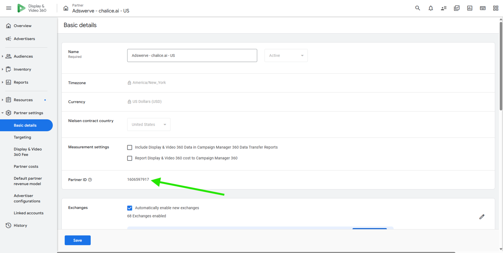
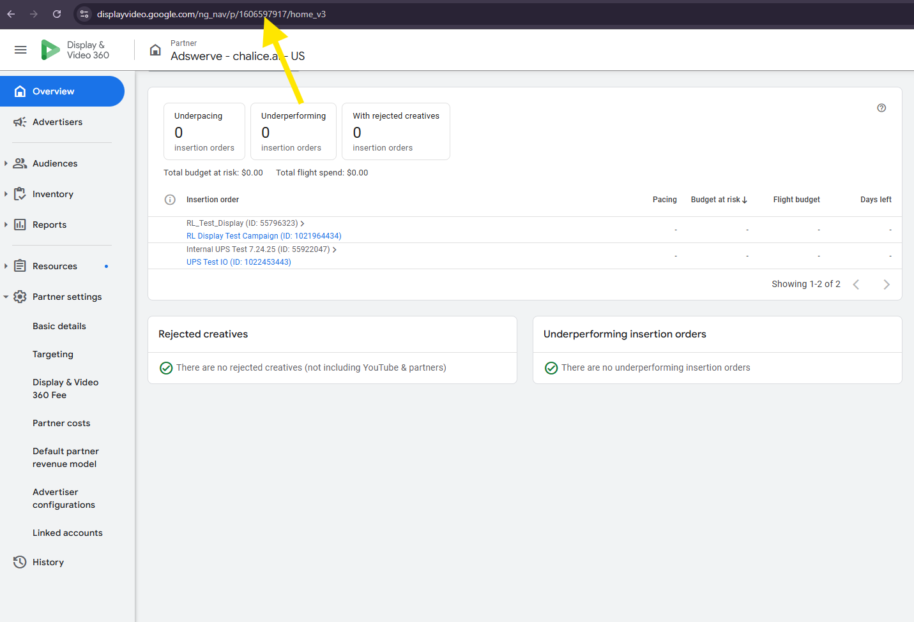
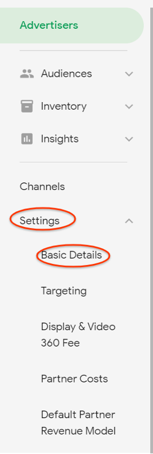
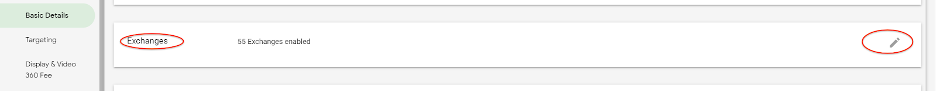
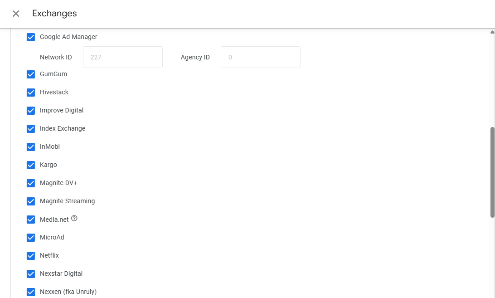
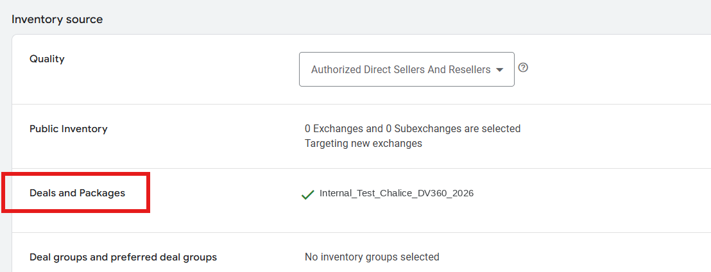
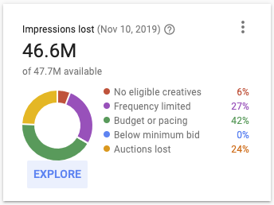
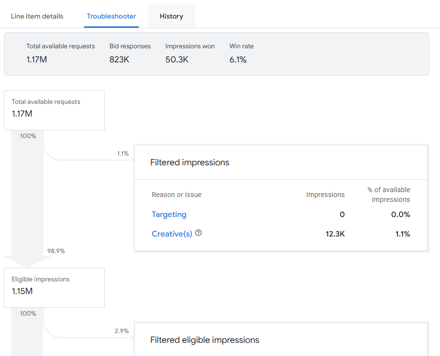
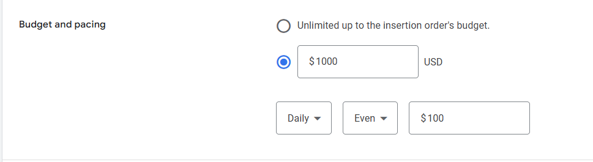
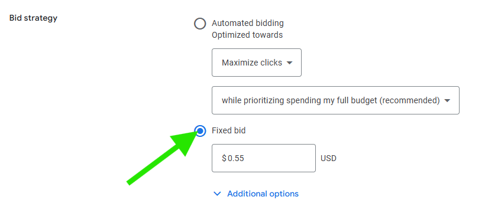

# DV360 PMP Troubleshooting

If a Chalice PMP deal is not delivering in DV360, work through these checks. The first section covers no delivery at all (zero bids and zero wins). The second covers low or limited delivery. The last section covers bid strategy, which is the most common cause of throttled delivery.

New to the setup? See the [Line Item Setup Guide for PMP Deals in DV360](line-item-setup-guide-pmp.md) and [DV360 Deal Setup Best Practices](deal-setup-best-practices.md).

---

## Seeing zero bids and zero wins? Start here

1. **Confirm the deal went to the correct buyer seat.** In DV360 this is your partner ID. You can find it in the Basic details section of Settings, or in the browser URL.

    

    

2. **Confirm the partner is opted into the SSP behind the deal.** Go to **Partner > Settings**, open **Basic details**, scroll to **Exchanges**, and check the exchange you are using.

    

    

    

3. **Confirm nothing is paused.** Check the status at the campaign, insertion order, and line item levels. A pause at any level stops delivery.

4. **Check creative approvals.** Make sure your creatives are approved and servable. Restrictions can result in no spend.

5. **Check your flight dates.** Confirm the insertion order and line item dates are current.

6. **Confirm the correct deal is on the line item.** Check the Deals and inventory packages section of the line item.

    <video controls preload="metadata" poster="assets/dv360-ts-deal-assignment-poster.jpg" width="100%">
      <source src="assets/dv360-ts-deal-assignment.mp4" type="video/mp4">
      Your browser does not support the video tag.
    </video>

    If the clip does not play inline, [open it in a new tab](assets/dv360-ts-deal-assignment.mp4).

7. **Target the deal only, not open auction.** Make sure the line item targets the deal and not public inventory.

    

8. **Check the impression lost monitor.** It shows what is blocking delivery. See [DV360 help on the impression lost monitor](https://support.google.com/displayvideo/answer/3103324).

    

9. **Run the troubleshooter tool.** It shows what is blocking your specific PMP. See [DV360 help on the troubleshooter](https://support.google.com/displayvideo/answer/6292894).

    

---

## Seeing few or very limited bids and wins?

Tightly layered targeting is the usual cause. Work through these settings and loosen where you can.

1. **Geo targeting.** Are your avails coming from the targeted geos? Expand the geos if they are limited, or layer geo targeting on only one end rather than both the deal and the line item.
2. **Environment.** Target the environment the deal sends. For example, if the deal sends web and mobile in-app but you target only mobile in-app, align the two.
3. **Devices.** Match the devices the deal sends. If the deal sends tablet and mobile, target those too.
4. **Day parting.** Check whether day parting is limiting delivery.
5. **Site block lists.** Look for extensive block lists that cut your avails.
6. **Brand safety keyword blocks.** Loosen overly strict keyword blocks where you can.
7. **Audience size.** If the audience is too small, expand it to help delivery.
8. **Frequency capping.** Reduce or remove frequency caps to help scale.
9. **Budget and pacing.** Check for strict budget caps on the line item.

    

10. **Viewability filters.** A pre-bid viewability filter set right at your goal blocks everything below it. Set the filter below the goal so you average out at the goal. For example, with a 70% goal, a 50% to 60% filter still averages around 70% while giving you more scale.

---

## Check your bid strategy

!!! warning "The most common cause of throttled delivery"
    DV360 automated bidding can bid below the deal floor when the KPI is hard to hit. That throttles or kills delivery on your deal.

The best practice is a fixed bid. It keeps control of delivery. Set it at the line item level under bid strategy.

- Suggested fixed bid for Display: around $2
- Suggested fixed bid for Video: around $5

If you want to keep automated bidding, enable "Prioritize deals over open auction inventory" on the line item.

This raises your bid to the deal floor for higher-value impressions, so you win more on your targeted deals. It can reduce automated bidding performance, for example when maximizing clicks or conversions, because it overrides the calculated bid to favor your deals.

For the full rundown of bidding and budget settings, see [DV360 Deal Setup Best Practices](deal-setup-best-practices.md).

---

## Related articles

- [Line Item Setup Guide for PMP Deals in DV360](line-item-setup-guide-pmp.md)
- [DV360 Deal Setup Best Practices](deal-setup-best-practices.md)
- [Accepting a PMP Deal in DV360](accepting-a-pmp-deal.md)
