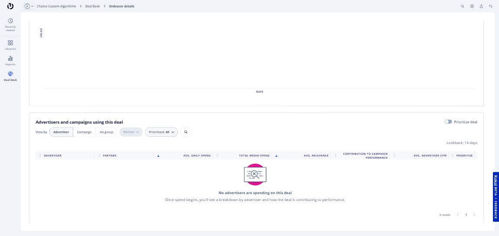
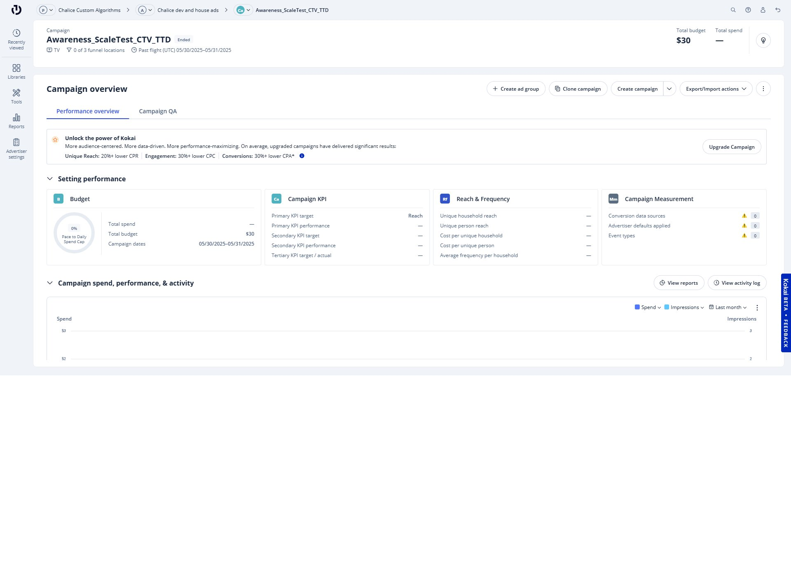
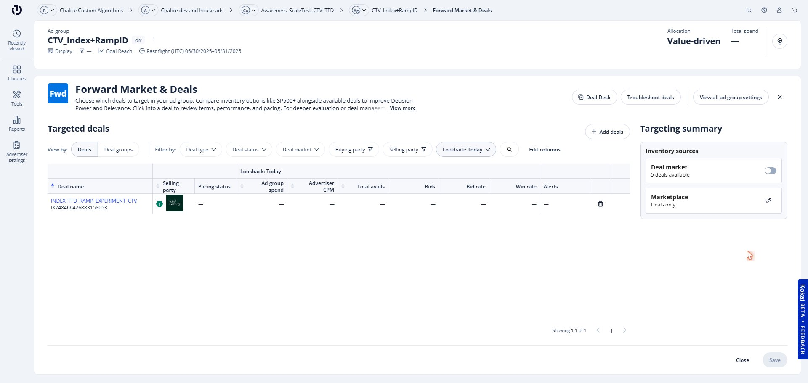
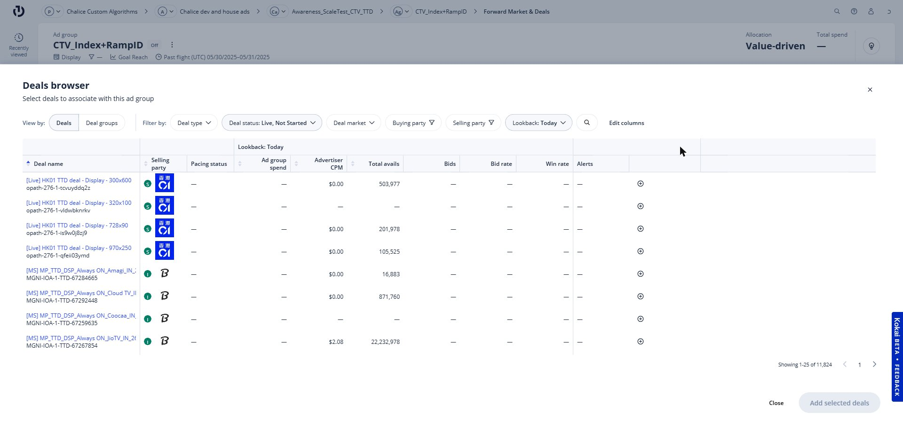

# Ad Group Best Practices for PMP Deals in TTD

Follow these steps to create a new Ad Group that targets a Chalice PMP deal exclusively. This ensures your budget is directed to the deal inventory and not competing with open exchange.

---

## Step 1. Enable "Prioritize Deal" on the Endeavor

After you [accept the PMP deal in your Deal Desk](accepting-a-pmp-deal.md), click on your deal and go to **Endeavor Performance**. Scroll down and toggle **Prioritize Deal** to on.

!!! tip
    Enabling "Prioritize Deal" ensures TTD sends eligible bid requests to this deal before considering open exchange inventory.

---

## Step 2. Create a new Ad Group

From your campaign overview, click **+ Create ad group**.

---

## Step 3. Enter the Ad Group name and configure settings

Enter a descriptive Ad Group name that references the deal (e.g., `Chalice PMP - [Deal ID] - [Campaign]`). Complete the remaining required settings and proceed to the ad group overview.

---

## Step 4. Open the Forward Market & Deals tile

In the ad group overview, click the **Forward Market & Deals** tile.

---

## Step 5. Set inventory to "Deals only" and add the deal

1. Click **+ Add deals**
2. Set the following filters:
    - **View by:** Deals
    - **Deal Type:** Endeavor
    - **Deal Status:** All
    - **Selling Party:** The SSP the deal was created in
    - Or search by Deal ID using the search icon
3. Select your deal by clicking the **+** icon, then click **Add selected deals**

---

## Step 6. Confirm and save

Back on the **Forward Market & Deals** screen, confirm your deal appears under **Targeted deals** and that **Marketplace** is set to **Deals only**. Click **Save**.

---

## Step 7. Verify in your Ad Group

Navigate back to your ad group. The **Forward Market & Deals** tile should show your deal as Endeavor Targeted.

!!! warning
    If the deal does not appear, go back and confirm the deal was accepted in the Deal Desk and that "Deals only" is set in the Forward Market & Deals tile.

---

## Related articles

- [Accepting a PMP Deal in TTD](accepting-a-pmp-deal.md)
- [Reaccepting a PMP Deal After Terms Have Been Updated](reaccepting-a-pmp-deal.md)
