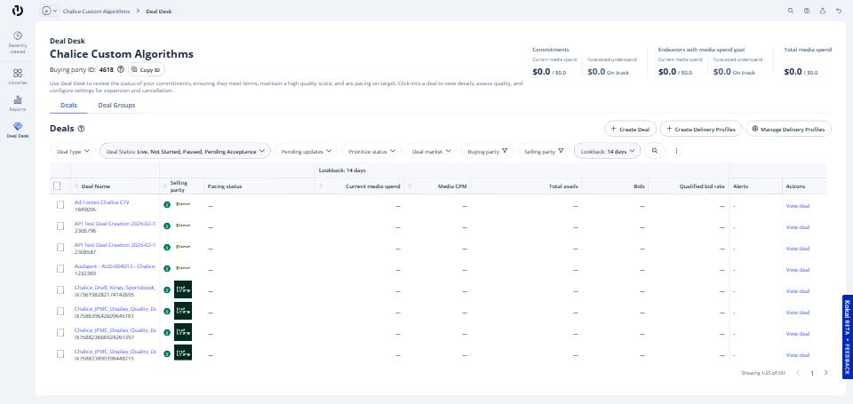
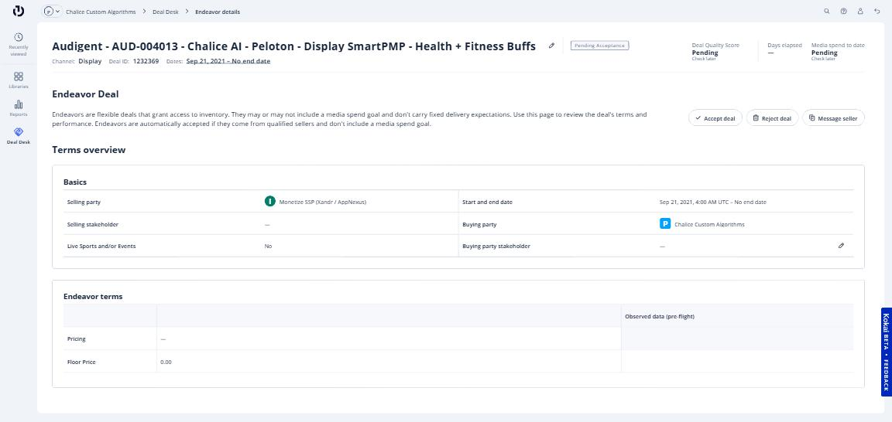

# Deal Desk: Reaccepting a PMP Deal After Terms Have Been Updated

Below are the steps to reaccept a PMP deal when your Chalice account manager has made updates after the original acceptance. Common adjustments include changes to the flight dates or the floor price.

---

## Step 1. Locate the deal

Open the **Deals Desk** icon on the left side panel. After selecting it, search for the Deal ID provided by your Chalice account manager.

---

## Step 2. Open the deal and review the proposed changes

Select the deal by clicking the deal name.

On the right side of the window, under **Recommended actions**, click **Review changes** to view the updates proposed by the seller.

---

## Step 3. Accept the updated terms

Review the revised terms for accuracy. If the changes look correct, select **Accept**.

The updated terms will go into effect immediately once accepted.

---

!!! note
    If you have questions about why terms were updated, reach out to your Chalice account manager before accepting.

---

## Related articles

- [Accepting a PMP Deal in TTD](accepting-a-pmp-deal.md)
- [Ad Group Best Practices for PMP Deals (TTD)](ad-group-best-practices-pmp.md)
